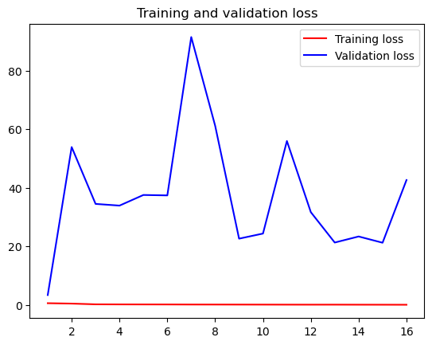
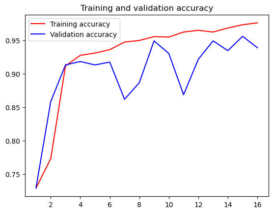

# PNEUMONIA INTERPRETATION PROJECT

## Overview
Given imges of chest x-rays we will use Machine Learning techniques to determine if the patient has pneumonia

## Business Understanding
Correctly predicting pneumonia from an image will greatly imporve accuracy and effiency, and cost reduction. The Hospital has provided us with images of normal type, and pneumonia type. We will use Machine Learning to train a model on the images and predict outcomes of new images.

## Data Understanding

The images were provided in two sets, those that have pneumonia and those that do not. To create traning, test, and validation sets we randomly assigned images to each group. 80% were put in the trainig group, 20% in the testing group.  The validation group was composed fo 20% of the images taken from the complete set of images.
The images are of different but large sizes like 1704 × 1122. For one model we changed all images to size 224x224x3 and for another model  we used size 112x112x3.

## Data Preparation
The data was given as two groups Normal and Pneumonia. We created test, train, and validation sets from these folders using Linux command line.
Random files were moved form each group into test, train, and validate folders. The amount of files were 80% train, 20% test, 20% validate. These exceed 100% because validate was randomly chosen from the full dataset.
To prepare the data we changed the image sizes, and created batches of size 64 for CNN and 16 fo ConvNext.

## Model 1 -- CNN

This is a tensflow Conv2D model with 10 layers, relu activation and a .001 learning rate.
We achived 92% accuracy on the test data set.

## Model 2 -- ConvNeXt Model
This model is a ConvNeXtTiny model with softmax activation and a .01 learning rate.
We achived 72% accuracy on the test data set.

## Evaluation
Using Neural Networks for this project was less complext than implementing other methods like Logistic Regression. 
One of our models performed well with 92% accuracy while the other came in with 72% accuracy

## Repository Structure

* ReadMe.md --------->            This file
* notebook.ipynb ------>       Project Jupyter notebook
* presentation.pdf ----->      Project presentation
* images --------------> Images used in the notebook and presentation
* zippedData ----------> Data files used for the project

## Link to presentation